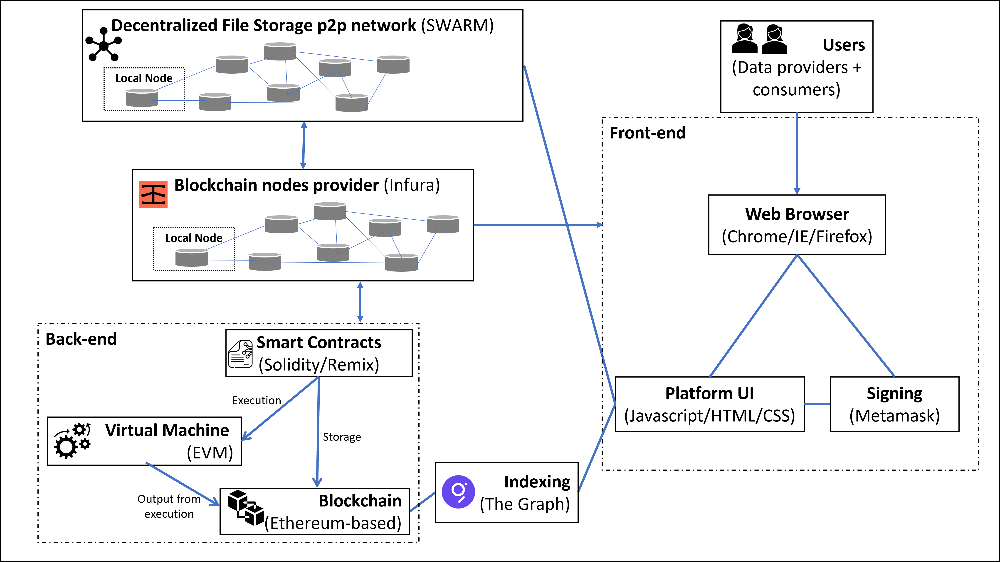

## Getting started

* [Opening GitHub repo in VS code](https://docs.microsoft.com/en-us/visualstudio/get-started/tutorial-open-project-from-repo?view=vs-2022)
* [Commiting changes in VS code](https://www.digitalocean.com/community/tutorials/how-to-use-git-integration-in-visual-studio-code)
* [Live Sharing for VS Code](https://code.visualstudio.com/learn/collaboration/live-share) - need to install both the Live Share and Live Share Audio extensions.

The general approach for this documentation is that each technology has its own page, and cross-links between the pages are documented.

## Technology resource pages

* [Metamask](metamask.md)
* [Ethereum](ethereum.md)
* [Decentralised file storage](decen_file_storage.md)
* [Solidity](solidity.md)
* [Remix](remix.md)
* [Javascript](javascript.md)

See also our [**Glossary of terms**](Glossaryofterms.md).

## Summary of approach

1. The user interacts with the front-end code via a web browser. Users can be data providers or data consumers. 

1. The platform will be written in a combination of [Javascript](javascript.md), HTML and CSS. Functionality will include: 

    - Proof of data ownership 

    - "Selling” data (uploading to the platform so that it can be bought in the future) 

    - Buying data 

1. Front-end code is hosted on a web-server (possibly the AWS cloud via NCI), or for true decentralisation, can be hosted on a distributed file storage system such (see the [Decentralised File Storage](decen_file_storage.md) page for more details). 

1. The back-end logic is managed by a series of [smart contracts](ethereum.md#smart-contracts) stored on the [Ethereum blockchain](ethereum.md#ethereum-virtual-machine). 

1. Data is stored on SWARM, a [distributed file storage system](decen_file_storage.md). See transaction examples below for more details.  

1. The frontend platform interacts with the Ethereum blockchain via a node hosted either locally or by Infura (a provider), which broadcasts transactions inititated by the platform across the network.  

1. Viewing the blockchain's state (for data searching/validating proof of ownership) does not require any signature (reading is permissive), but to submit a transaction to the chain, it must be signed (writing is restricted). This is managed by MetaMask. 

1. The platform allows for searching of the blockchain data via [The Graph](thegraph.md). Here, Ethereum blockchain data is indexed to allow for low-latency querying of on-chain data in our application logic. 

  

## User stories

**Transactions – Post data to platform**

1. User interacts with platform to execute “sell” transaction. Tokens (“gas”) are sent as part of transaction.  

1. Platform interacts with Swarm via “Bee” local node to store data (can be private or public). Data is split into 4kb chunks and distributed across the P2P network.  This process returns the address of the uploaded file as a hash. 

1. Platform then broadcasts a transaction that calls a smart contract on the Ethereum blockchain via a Infura-/locally-hosted node. This smart contract takes the Swarm-provided hash along with some metadata (type of data, cost of purchase, processing date and time, statistical features for watermarking). The contract is executed in the Ethereum virtual machine. 

1. Transaction is mined (included in a new block) and then verified by the rest of the distributed system, with proof of completion returned to the platform. 

 

**Transactions – Buy data from platform**

1. User interacts with platform to search existing datasets. Indexing of data has been managed by The Graph, and queries are possible with low latency.  

1. User identifies the dataset of interest. 

1. User executes “buy” transaction via the platform, which sends the cost of the data in Ether to the Ethereum address of the smart contract responsible for that dataset.  

1. This triggers the smart contract, which is executed in the EVM. If the requirements (price) are met, the smart contract sends the hash of the data stored on Swarm back to the platform, allowing the user to access the data. [One potential issue here is that anyone can access the hash of the data if it is stored on the Ethereum blockchain] 

